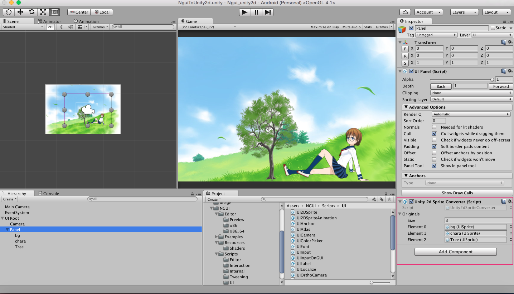

#NGUIのテクスチャをUnity2dのspriteで表示するツール

***
このツールは、NGUIのアトラス化した画像をUnity2dのspriteで表示するための
ツールです。

##使用用途
・3dオブジェクトとNGUIを組み合わせた時、NGUIのspriteがうまく表示されない場合の対処として(unity2dで対応する)  
・NGUIで作成したテクスチャをUnity2dのspriteとして使いたい  

##必要条件
・NGUI(この記事では3.9.8を使っています)をインストールしていること  

##使用方法
1.NguiToUnity2dConverter.csをダウンロードしプロジェクト内に入れます
/Assets/Script/Unity2dSpriteConverter.cs

2.ゲームオブジェクトに「NguiToUnity2dConverter.cs」を反映させる

3.以下の図を参考にUnity2dのsprite表示させたいUISpriteを選択します。

4.その結果、NguiのspriteがUnity2dのspriteで表示されます。

